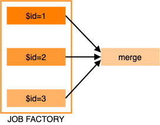

## Multiple job factories
It is possible to define a single workflow including multiple job factories applied to different jobs. For example:
```json
{
  "name": "multiple-job-factories",
  "jobs": [
    {
      "resources": {
        "nodes": 1,
        "cpus": 1,
        "memory": 1,
        "disk": 10
      },
      "tasks": [
        {
          "image": "busybox",
          "runtime": "singularity",
          "cmd": "echo A $frame"
        }
      ],
      "name": "renderA"
    },
    {
      "resources": {
        "nodes": 1,
        "cpus": 1,
        "memory": 1,
        "disk": 10
      },
      "tasks": [
        {
          "image": "busybox",
          "runtime": "singularity",
          "cmd": "echo B $frame"
        }
      ],
      "name": "renderB"
    }
  ],
  "factories": [
    {
      "name": "render-frames-A",
      "type": "parameterSweep",
      "jobs": [
        "renderA"
      ],
      "parameters":[
        {
          "name": "frame",
          "start": 1,
          "end": 4,
          "step": 1
        }
     ]
    },
    {
      "name": "render-frames-B",
      "type": "parameterSweep",
      "jobs": [
        "renderB"
      ],
      "parameters":[
        {
          "name": "frame",
          "start": 1,
          "end": 3,
          "step": 1
        }
     ]
    }
  ]
}
```
When this workflow is submitted we can see the different job factories have been applied to the appropriate jobs:
```
$ prominence list
ID      NAME                               CREATED               STATUS   ELAPSED      IMAGE     CMD          
53242   multiple-job-factories/renderA/0   2021-10-02 07:27:50   idle                  busybox   echo A $frame
53243   multiple-job-factories/renderA/1   2021-10-02 07:27:50   idle                  busybox   echo A $frame
53244   multiple-job-factories/renderA/2   2021-10-02 07:27:52   idle                  busybox   echo A $frame
53245   multiple-job-factories/renderA/3   2021-10-02 07:27:52   idle                  busybox   echo A $frame
53246   multiple-job-factories/renderB/0   2021-10-02 07:27:55   idle                  busybox   echo B $frame
53247   multiple-job-factories/renderB/1   2021-10-02 07:27:55   idle                  busybox   echo B $frame
```

A single workflow can of course contain different types of job factories.

## Combining job factories and DAGs
It is possible to define a workflow involving both job factories and dependencies between jobs, for example:



In the example job description below we use a job factory to
run 3 `process` jobs, then once these have completed a `merge` job is run.
```json
{
  "name": "factory-dag-workflow",
  "jobs": [
    {
      "resources": {
        "nodes": 1,
        "cpus": 1,
        "memory": 1,
        "disk": 10
      },
      "tasks": [
        {
          "image": "busybox",
          "runtime": "singularity",
          "cmd": "echo $id"
        }
      ],
      "name": "process"
    },
    {
      "resources": {
        "nodes": 1,
        "cpus": 1,
        "memory": 1,
        "disk": 10
      },
      "tasks": [
        {
          "image": "busybox",
          "runtime": "singularity",
          "cmd": "echo merge"
        }
      ],
      "name": "merge"
    }
  ],
  "factories": [
    {
      "name": "processing",
      "type": "parameterSweep",
      "jobs": [
        "process"
      ],
      "parameters":[
        {
          "name": "id",
          "start": 1,
          "end": 3,
          "step": 1
        }
      ]
    }
  ],
  "dependencies": {
    "process": ["merge"]
  }
}
```
In the `dependencies` section of the job description, for each parent job we list children. So in this case jobs with name `process` are run before
the job with name `merge`. As expected, we see that initially only the `process` jobs are created and start running:
```
$ prominence list
ID      NAME                             CREATED               STATUS    ELAPSED      IMAGE     CMD     
53250   factory-dag-workflow/process/0   2021-10-02 07:34:24   running   0+00:00:01   busybox   echo $id
53251   factory-dag-workflow/process/1   2021-10-02 07:34:24   running   0+00:00:01   busybox   echo $id
53252   factory-dag-workflow/process/2   2021-10-02 07:34:26   running   0+00:00:01   busybox   echo $id
```
Once all these have completed any dependent jobs will start.
