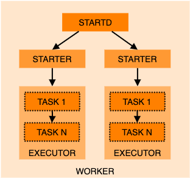
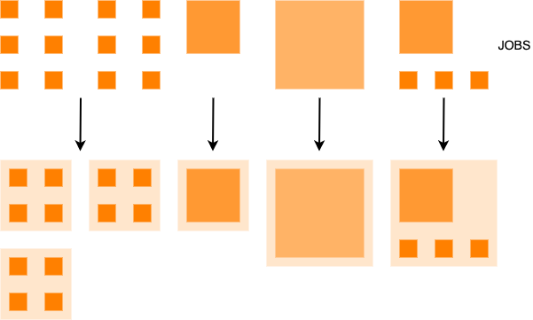

# Architecture

## Overview

A basic overview of the architecture is as follows:

PROMINENCE makes use of [HTCondor](https://htcondor.org/) for managing jobs and workflows as well as providing the ability to
execute jobs on remote computing resources.
* IAM: Indigo IAM provides identity, authentication and authorisation
* Schedd: HTCondor daemon providing the job queue
* Collector: HTCondor daemon storing lists of workers (startds)
* Negotiator: HTCondor daemon which matches jobs to workers
* Scaler: Decides when to create new workers on demand
* IMC: Provisions resources on clouds, including failure handling and retries
* IM: [Infrastructure Manager](https://www.grycap.upv.es/im/index.php) provides an abstraction layer across different cloud APIs

In addition:
* [Etcd](https://etcd.io/) is used for distributed coordination and as a key-value store
* [Elasticsearch](https://www.elastic.co/) is used for job accounting

On workers:

* Startd: HTCondor daemon running on a worker, which advertises resources to the HTCondor Collector and launches jobs via the HTCondor Starter. Depending on the resources required by each job, there may be one or multiple starters running concurrently.
* Executor: Manages execution of a single job, including pulling container images, downloading data, making storage available, running tasks in containers and uploading any output data.

## Workers
**Static pools** of workers are like a traditional batch system. This is essential for almost-full private clouds
where it can be very difficult or even impossible to get VMs with large numbers of CPUs.

In **dynamic heterogenous pools** workers are created on demand and are deleted after being idle for 10 minutes. Jobs requiring
small numbers of CPUs (typically less than 8) are packed onto larger workers, whilst larger jobs run on dedicated VMs with
sizes tailored for each job.

