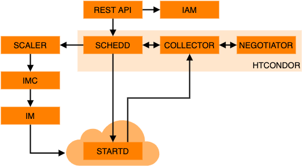

# Architecture

A basic overview of the architecture is as follows:

PROMINENCE makes use of [HTCondor](https://htcondor.org/) for managing jobs and workflows as well as providing the ability to
execute jobs on remote computing resources.
* Schedd: HTCondor daemon providing the job queue
* Collector: HTCondor daemon storing lists of workers (startds)
* Negotiator: HTCondor daemon which matches jobs to workers
* Scaler: Decides when to create new workers on demand
* IMC: Provisions resources on clouds, including failure handling and retries
* IM: [Infrastructure Manager](https://www.grycap.upv.es/im/index.php) provides an abstraction layer across different cloud APIs

On workers:
* Startd: HTCondor daemon running on worker, which advertises resources to the HTCondor Collector and launches jobs via the Starter
* Executor: Manages execution of a single job, including pulling container images, downloading data, running tasks in containers and uploading any output data

In addition:
* [Etcd](https://etcd.io/) is used for distributed coordination and as a key-value store
* [Elasticsearch](https://www.elastic.co/) is used for job accounting

