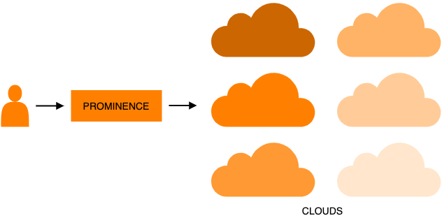
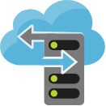

# PROMINENCE
{: .fs-9 }

A platform allowing users to exploit cloud resources for running containerised workloads.
{: .fs-6 .fw-300 }

 

 

<h3>Run jobs from anywhere</h3>
Submit jobs using a simple batch system style command line interface from your laptop. And your desktop. Or from anywhere else. Alternatively, interact programmatically using a RESTful API.
 
 

<h3>Invisible infrastructure</h3>
Run jobs without worrying about servers or clusters.
All infrastructure provisioning is handled completely automatically and transparently.
 
 

<h3>Multi-cloud native</h3>
Go beyond a single cluster or cloud and leverage the resources and features available across many clouds simultaneously.
 
 

<h3>Reliability and reproducibility</h3>
All jobs are run in containers to ensure they will can run reliably anywhere and are reproducible.
 
 

<h3>MPI ready</h3>
Run multi-node Open MPI, Intel MPI or MPICH jobs in addition to single-node HTC jobs.
 
 

<h3>Workflows</h3>
Construct complex workflows by specifying the dependencies between different jobs, or run large numbers
of similar jobs, for example for parameter scans, based on templates.
 
 

<h3>Data access</h3>
Jobs can access data from object storage or in a POSIX-like way from [OneData](https://onedata.org) or WebDAV (including [B2DROP](https://b2drop.eudat.eu)).
 
 

