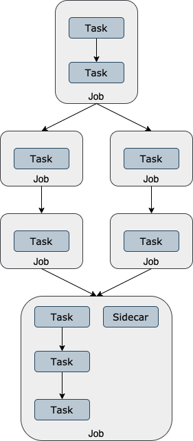

A job in PROMINENCE consists of the following:
* Name
* Labels
* Input files
* Output files
* Required resources (e.g. CPU cores, memory, disk)
* One or more task definitions
* Policies (e.g. how many times should failing tasks should be retried or where to run the job)
* Notifications (e.g. to specify email notification upon job completion)

Tasks execute sequentially within a job, and consist of the following:
* Container image
* Container runtime (Singularity or udocker)
* Command to run and optionally any arguments
* Environment variables
* Working directory

A workflow consists of:
* Name
* Labels
* One or more job definitions
* Any dependencies between jobs
* Factories to generate multiple jobs based on job templates

Jobs within a workflow can be executed sequentially, in parallel or combinations of both. Tasks within a job share the same scratch directory, whereas different jobs within a workflow do not.

An example workflow, including how it is made up of jobs and tasks, is shown below:

## Environment variables available to jobs
The following environment variables will be set by default:
* PROMINENCE_CPUS: the number of CPUs available (which could be larger than what was requested)
* PROMINENCE_MEMORY: the amount of memory in GB available (which could be larger than what was requested)
* PROMINENCE_NODES: the number of nodes in the job
* PROMINENCE_NODE_NUM: the id of the node in a multi-node job, starting from 0
* PROMINENCE_CONTAINER_RUNTIME: the container runtime in use, either `singularity` or `udocker`
* PROMINENCE_JOB_ID: the id of the job
* PROMINENCE_WORKFLOW_ID: the id of the associated workflow, if applicable
* PROMINENCE_URL: URL of the PROMINENCE REST API
* PROMINENCE_TOKEN: token which can be used to authenticate against the PROMINENCE REST API (a unique token is generated per job, and is valid
for the lifetime of the job)
