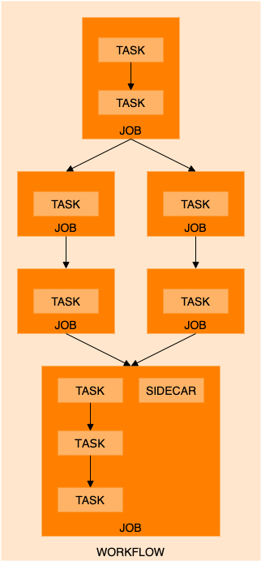

# Jobs, tasks and workflows

## Jobs
A job in PROMINENCE consists of the following:
* Name
* Labels
* Input files
* Output files
* Storage (e.g. WebDAV or OneData storage mounted in the container)
* Required resources (e.g. CPU cores, memory, disk)
* One or more task definitions
* Policies (e.g. how many times should failing tasks should be retried or where to run the job)
* Notifications (e.g. to specify email notification upon job completion)

## Tasks
Tasks execute sequentially within a job, and consist of the following:
* Container image
* Container runtime (Singularity or udocker)
* Command to run and optionally any arguments
* Environment variables
* Working directory

## Workflows
A workflow consists of:
* Name
* Labels
* One or more job definitions
* Any dependencies between jobs
* Factories to generate multiple jobs based on job templates
* Policies (e.g. how many times should failing jobs should be retried)
* Notifications (e.g. to specify email notification upon workflow completion)

Jobs within a workflow can be executed sequentially, in parallel or combinations of both. Tasks within a job share the same scratch directory, whereas different jobs within a workflow do not.

An example workflow, including how it is made up of jobs and tasks, is shown below:

