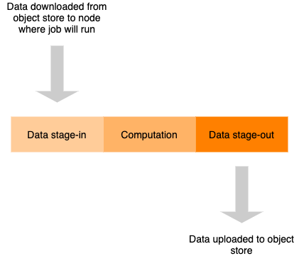

There are currently several options to access data in PROMINENCE, and more are under development.

## Cloud storage
Here we make use of central Ceph-based storage using the S3 API. Users can upload data which can be accessed by jobs (including container images), and output files from jobs can be copied to the storage. Note that data cannot be accessed as though it were in a normal filesystem: input data is staged-in before the job starts and output data is staged-out once the job has finished. PROMINENCE is able to provide presigned URLs to access the data.



## POSIX-like access to data
It is possible for jobs to access data in a POSIX-like way, i.e. like a filesystem. Users can specify the mountpoint to be used inside the container.

### B2DROP
In order to mount your B2DROP storage in jobs firstly an app username and password needs to be created. This can be done by going to [https://b2drop.eudat.eu/settings/user/security](https://b2drop.eudat.eu/settings/user/security) and clicking *Create new app password*.

The following JSON needs to be included in the job description if access to B2DROP is required:
```json
"storage":{
  "type":"b2drop",
  "mountpoint":"/data",
  "b2drop":{
    "app-username":"***",
    "app-password":"***"
  }
}
```
where the app username and password should be set as appropriate. The mountpoint `/data` here is just an example and can be replaced with something else.

Using the PROMINENCE CLI to create jobs, the `--storage` option can be used to specify the name of a JSON file containing the above content. For example:
```
prominence create --storage my-b2drop.json ...
```

### OneData
In order to mount your OneData storage in jobs firstly an access token needs to be created using the *Access tokens* menu in the OneData web interface.

The following JSON needs to be included in the job description if access to OneData is required:
```json
"storage":{
  "type":"onedata",
  "mountpoint":"/data",
  "onedata":{
    "provider":"***",
    "token":"***"
  }
}
```
where the provider hostname and access token should be set as appropriate. The mountpoint `/data` here is just an example and can be replaced with something else.

Using the PROMINENCE CLI to create jobs, the `--storage` option can be used to specify the name of a JSON file containing the above content. For example:
```
prominence create --storage my-onedata.json ...
```

