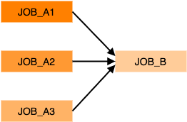

## Overview
In order to submit a workflow the first step is to write a JSON description of the workflow. This is just a list of the definitions of the individual jobs (which can be created easily using `prominence create --dry-run`, see [here](/docs/generating-json)) along with the dependencies between them. Each dependency defines a parent and its children. The basic structure is:
```json
{
  "name":"test-workflow-1",
  "jobs":[
    {...},
    {...}
  ],
  "dependencies":{
    "parent_job":["child_job_1", ...],
    ...
  }, 
  "numberOfRetries":1
}
```
Each of the individual jobs must have defined names as these are used in order to define the dependencies. Unlike [CWL](https://www.commonwl.org/) or [WDL](https://github.com/openwdl/wdl) dependencies need to be defined explicitly rather than being based on input and output files.

It is important to note that the resources requirements for the individual jobs can be (and should be!) specified. This will mean that each step in a workflow will only use the resources it requires. Jobs within a single workflow can of course request very different resources, which makes it possible for workflows to have both HTC and HPC steps.

By default the number of retries is zero, which means that if a job fails the workflow will fail. If the number of retries is set to one
 or more, if an individual job fails (i.e. exit code is not 0) it will be retried up to the specified number of times.

## Examples
It is worthwhile to look at some simple examples in order to understand how to define workflows.

### Multiple steps
Here we consider a simple workflow consisting of multiple sequential steps, e.g.


In this example `job_A` will run first, followed by `job_B`, finally followed by `job_C`. A basic JSON description is shown below:
```json
{
  "name": "multi-step-workflow",
  "jobs": [
    {
      "resources": {
        "nodes": 1,
        "cpus": 1,
        "memory": 1,
        "disk": 10
      },
      "tasks": [
        {
          "image": "busybox",
          "runtime": "singularity",
          "cmd": "date"
        }
      ],
      "name": "job_A"
    },
    {
      "resources": {
        "nodes": 1,
        "cpus": 1,
        "memory": 1,
        "disk": 10
      },
      "tasks": [
        {
          "image": "busybox",
          "runtime": "singularity",
          "cmd": "date"
        }
      ],
      "name": "job_B"
    },
    {
      "resources": {
        "nodes": 1,
        "cpus": 1,
        "memory": 1,
        "disk": 10
      },
      "tasks": [
        {
          "image": "busybox",
          "runtime": "singularity",
          "cmd": "date"
        }
      ],
      "name": "job_C"
    }
  ],
  "dependencies": {
    "job_A": ["job_B"],
    "job_B": ["job_C"]
  }
}
```

### Scatter-gather
He we consider the common type of workflow where a number of jobs can run in parallel. Once these jobs have completed another job will run. Typically this final step will take output generated from all the previous jobs. For example:



A basic JSON description is shown below:
```json
{
  "name": "scatter-gather-workflow",
  "jobs": [
    {
      "resources": {
        "nodes": 1,
        "cpus": 1,
        "memory": 1,
        "disk": 10
      },
      "tasks": [
        {
          "image": "busybox",
          "runtime": "singularity",
          "cmd": "date"
        }
      ],
      "name": "job_A1"
    },
    {
      "resources": {
        "nodes": 1,
        "cpus": 1,
        "memory": 1,
        "disk": 10
      },
      "tasks": [
        {
          "image": "busybox",
          "runtime": "singularity",
          "cmd": "date"
        }
      ],
      "name": "job_A2"
    },
    {
      "resources": {
        "nodes": 1,
        "cpus": 1,
        "memory": 1,
        "disk": 10
      },
      "tasks": [
        {
          "image": "busybox",
          "runtime": "singularity",
          "cmd": "date"
        }
      ],
      "name": "job_A3"
    },
    {
      "resources": {
        "nodes": 1,
        "cpus": 1,
        "memory": 1,
        "disk": 10
      },
      "tasks": [
        {
          "image": "busybox",
          "runtime": "singularity",
          "cmd": "date"
        }
      ],
      "name": "job_B"
    }
  ],
  "dependencies": {
    "job_A1": ["job_B"],
    "job_A2": ["job_B"],
    "job_A3": ["job_B"]
  }
}
```

